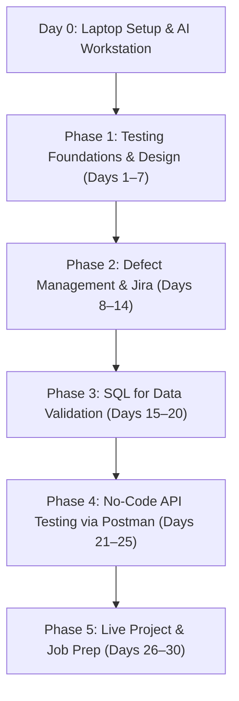
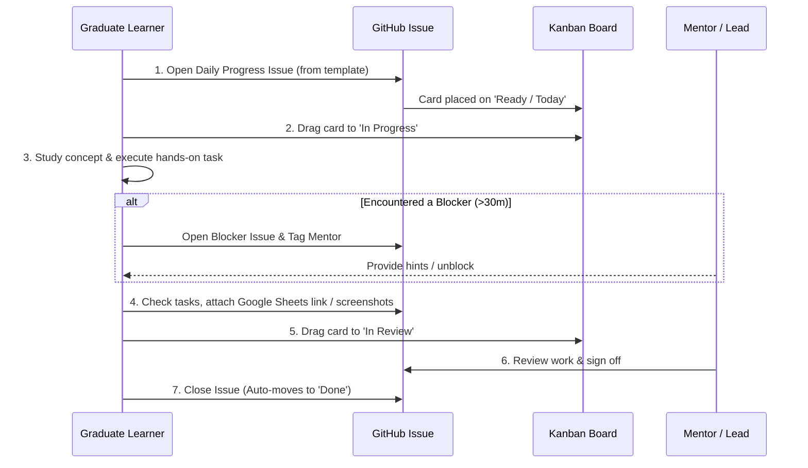

# 🎯 30-Day Day-by-Day Manual QA Training Plan & Progress Tracker

> **A zero-coding, high-impact curriculum designed to train fresh graduates in manual test design, Jira defect tracking, no-code API testing via Postman, and backend database validation with SQL.**

---

## 🌟 Overview & Core Principles

This program prepares graduates for immediate employment as **Manual QA Testers / QA Analysts** in software companies (with dedicated preparation for tech hubs like Hyderabad: HITEC City, Madhapur, Gachibowli, and Financial District).

- 🚫 **Zero Coding**: No programming languages required. Focus strictly on test design techniques, real project documentation, hands-on Jira tracking, Postman API testing, and SQL data validation.
- 🤖 **AI-Supercharged Workstation**: Leverage Google Gemini Desktop and Google Antigravity as on-demand mentors and documentation generators.
- 📋 **Industry-Standard Documentation**: Build test scenarios, test cases, and Requirement Traceability Matrices (RTM) using Google Sheets and Excel.
- 📊 **GitHub-Powered Tracking**: Track daily progress using **GitHub Issues**, **Pull Requests/Commits**, and a **Kanban Board**, while publishing the full curriculum as a **GitHub Pages** portal.

---

## 🧭 Curriculum Phases at a Glance

| Phase | Duration | Focus Topics | Key Deliverables |
| :--- | :--- | :--- | :--- |
| **Day 0** | Setup | Windows tools, Gemini Desktop, Antigravity, DevTools, Directory structure | Configured machine & AI dry-run |
| **Phase 1** | Days 1–7 | QA vs QC, SDLC/STLC, Levels, Functional vs Non-Functional, ECP, BVA, RTM | 50+ Test Cases & RTM in Google Sheets |
| **Phase 2** | Days 8–14 | Defect Life Cycle, Severity vs Priority, Jira Cloud, Zephyr, Agile Scrum | Sprint Simulation & Jira Bug Tickets |
| **Phase 3** | Days 15–20 | SQL DB Testing, SELECT, WHERE, Aggregations, JOINs, Mutation checks | SQL Verification Scripts |
| **Phase 4** | Days 21–25 | HTTP Basics, Status Codes, Postman Requests, Collections, Environments | Postman API Test Collection |
| **Phase 5** | Days 26–30 | Live Web Testing, Cross-Browser/Mobile, QA Resume, Hyderabad Job Strategy, Mock Interview | Portfolio Drive Links & Interview Readiness |

---

## ⚡ Quick Links & Navigation

| Resource | Description | Direct Link |
| :--- | :--- | :--- |
| 🛠️ **System Setup (Day 0)** | AI assistants, productivity tools, DevTools, folder structure | [View Setup Guide](curriculum/setup/README.md) |
| 🗺️ **Full 30-Day Syllabus** | Complete breakdown of all 5 phases and 30 days | [View Curriculum Roadmap](curriculum/overview.md) |
| 📅 **Day 1: QA Fundamentals** | Day 1 agenda, schedule, core concepts, exercise | [Go to Day 1](curriculum/days/phase-1/day-01/README.md) |
| 📝 **QA Templates** | Test Case template, Bug Report template, RTM template | [View Templates](curriculum/templates/test-case-template.md) |
| 📊 **Kanban Progress Guide** | How to use GitHub Projects to track daily progress | [Read Guide](guides/github-kanban-guide.md) |
| 🌐 **GitHub Pages Guide** | How to publish this curriculum as a live website | [Read Guide](guides/github-pages-guide.md) |

---

## 🔄 Daily Workflow for the Graduate

---

## 🌐 Live Documentation Website (GitHub Pages)

This repository includes a ready-to-use **Docsify** documentation portal in [`docs/`](docs/).
- Follow the [GitHub Pages Setup Guide](guides/github-pages-guide.md) to activate the site under **Settings -> Pages -> GitHub Actions**.
