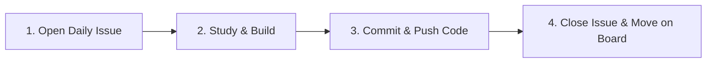

# 🚀 Software Engineering Jumpstart: Fresh Graduate Onboarding & Learning Tracker

Welcome to the **Software Engineering Jumpstart Program**! This repository serves as the single source of truth for your day-by-day learning journey, structured to bridge the gap between academic graduation and high-performance software engineering in tech companies.

---

## 🎯 Program Objectives

1. **Production-Grade Engineering Habits**: Master Git, modern IDEs, clean code, debugging, testing, and CI/CD.
2. **Real-World Tracking**: Learn to work like an agile engineering team using **GitHub Issues**, **Pull Requests**, and a **Kanban Board**.
3. **Structured Day-Wise Growth**: Daily targeted goals, curated reading, hands-on coding exercises, and self-assessment checklists.
4. **Accessible Knowledge**: Browse the entire curriculum as a live website powered by **GitHub Pages**.

---

## 🧭 Repository Structure

```tree
.
├── .github/
│   ├── ISSUE_TEMPLATE/       # Templates for daily task logging & raising doubts
│   └── workflows/            # GitHub Actions (automated Pages deployment)
├── curriculum/
│   ├── overview.md           # High-level syllabus & milestone map
│   ├── setup/                # Device setup, tooling, terminal, Git & IDE configuration
│   └── days/
│       ├── day-01/           # Day 1 detailed schedule, exercises, and deliverables
│       ├── day-02/           # Day 2 placeholder
│       └── template/         # Template for authoring subsequent days
├── docs/                     # Interactive GitHub Pages website (Docsify)
├── guides/                   # Step-by-step guides for GitHub Pages & Project Kanban boards
└── README.md                 # Project landing page (this file)
```

---

## ⚡ Quick Navigation

| Section | Description | Link |
| :--- | :--- | :--- |
| 🛠️ **Device Setup** | Operating system, terminal, Git, SSH keys, VS Code | [Start Setup](curriculum/setup/README.md) |
| 🗺️ **Curriculum Roadmap** | Multi-week milestone roadmap and core focus areas | [View Roadmap](curriculum/overview.md) |
| 📅 **Day 1 Details** | Day 1 agenda, learning targets, tasks & submission checklist | [Go to Day 1](curriculum/days/day-01/README.md) |
| 📋 **Day Template** | Copy-paste template for adding new days | [View Template](curriculum/days/template/day-template.md) |
| 📊 **Kanban Board Guide** | How to set up and use GitHub Projects for daily task tracking | [Read Guide](guides/github-kanban-guide.md) |
| 🌐 **GitHub Pages Guide** | How to publish and preview the curriculum as a live website | [Read Guide](guides/github-pages-guide.md) |

---

## 🔄 Daily Workflow for Learners

Each day follows a 4-step agile engineering loop:



1. **Start of Day**:
   - Go to the **Issues** tab on GitHub and click **New Issue**.
   - Choose the **Daily Progress Log** template.
   - Assign the issue to yourself, link it to your **GitHub Project (Kanban)**, and set status to `In Progress`.
2. **During the Day**:
   - Follow the instructions in `curriculum/days/day-XX/README.md`.
   - Complete the hands-on exercises in the `exercises/` folder.
   - If stuck for > 30 minutes, create an issue using the **Doubt / Blocker** template to request mentor support.
3. **End of Day**:
   - Check off all completed items in your daily GitHub Issue.
   - Paste links to your commits or pull requests in the issue comments.
   - Close the issue and move its card to `Done` on your Kanban board.

---

## 🌐 Viewing as a Website (GitHub Pages)

This repository includes a ready-to-use **Docsify** documentation portal in the [`docs/`](docs/) directory:
- Zero build steps required.
- Full-text instant search.
- Dark & Light mode toggle.
- Code block syntax highlighting with one-click copy buttons.

👉 Follow the [GitHub Pages Setup Guide](guides/github-pages-guide.md) to activate the website in under 2 minutes.

---

## 👥 Roles & Responsibilities

- **Learner / Fresh Graduate**: Proactively owns daily issues, logs daily progress, writes clean and tested code, commits regularly, asks structured questions.
- **Mentor / Lead**: Reviews pull requests, answers blocker issues, conducts weekly code reviews, and tracks progress across the Kanban board.
