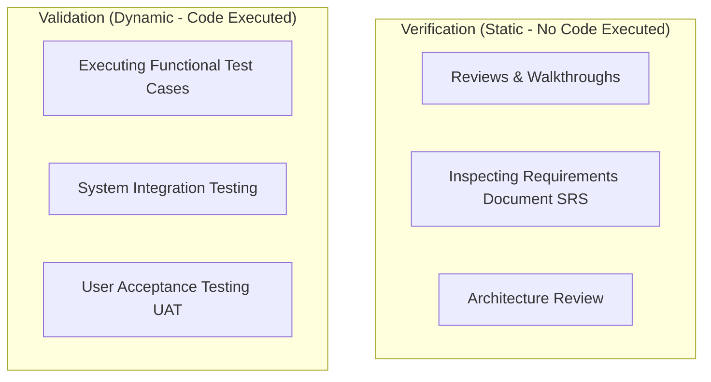

# 📅 Day 1: Software Landscape & QA Fundamentals

Welcome to **Day 1** of your Manual QA Training! Today establishes the foundational principles of software quality, the roles involved, and how software moves from concept to production.

---

## 🎯 Learning Objectives

By the end of today, you will:
- [ ] Understand the core distinctions between **Quality Assurance (QA)**, **Quality Control (QC)**, and **Software Testing**.
- [ ] Clearly explain the difference between **Verification** ("Are we building the product right?") and **Validation** ("Are we building the right product?").
- [ ] Understand how traditional **Waterfall** compares to modern **Agile Scrum**.
- [ ] Complete the Day 1 hands-on exercise on Verification vs Validation analysis.
- [ ] Answer the self-assessment interview questions and log your progress in your daily GitHub Issue.

---

## ⏱️ Daily Schedule

| Time Slot | Module | Focus Area |
| :--- | :--- | :--- |
| **09:00 - 09:30** | Standup & Daily Planning | Open your Day 1 GitHub Issue, assign to Kanban board under `In Progress`. |
| **09:30 - 11:00** | Core Theory 1: QA vs QC vs Testing | Definitions, process vs product orientation, proactive vs reactive approaches. |
| **11:00 - 12:30** | Core Theory 2: Verification vs Validation | Static vs dynamic testing, reviews, walkthroughs, inspections vs test execution. |
| **12:30 - 13:30** | *Lunch Break* | — |
| **13:30 - 15:00** | Software Models: Waterfall vs Agile | Sprints, user stories, standups, why Agile is dominant in modern IT companies. |
| **15:00 - 16:30** | Hands-On Exercise | Complete [Day 1 Exercise: Verification vs Validation Matrix](exercises/README.md). |
| **16:30 - 17:30** | Review & Interview Prep | Answer the 4 interview questions, submit exercise notes for mentor review. |

---

## 📖 Core Concepts Breakdown

### 1. QA vs. QC vs. Software Testing

| Attribute | Quality Assurance (QA) | Quality Control (QC) | Software Testing |
| :--- | :--- | :--- | :--- |
| **Definition** | Process-oriented activities to prevent defects. | Product-oriented activities to identify defects. | Sub-activity of QC involving executing software with inputs. |
| **Focus** | Prevention of defects. | Detection of defects. | Finding bugs before users find them. |
| **Approach** | Proactive. | Reactive. | Hands-on execution. |
| **Scope** | Entire software lifecycle processes. | The actual deliverables (code, documents). | The specific build, screen, or API. |
| **Example** | Code review process guidelines, STLC process design. | Inspecting a finished build against requirements. | Entering a 9-digit number in a 10-digit mobile field to verify error alert. |

---

### 2. Verification vs. Validation (Classic Interview Question)

- **Verification**: *"Are we building the product right?"*
  - Static testing technique (checking documents, design, code reviews WITHOUT executing the application).
  - Evaluates whether intermediate deliverables satisfy initial constraints.
- **Validation**: *"Are we building the right product?"*
  - Dynamic testing technique (executing the live software with test data).
  - Evaluates whether the final product meets customer expectations and business needs.

---

### 3. Waterfall Model vs. Agile Scrum

- **Waterfall Model**:
  - Sequential, phase-gated approach: Requirements -> Design -> Development -> Testing -> Deployment.
  - Testing only occurs at the very end of the cycle.
  - *Risk*: If a critical flaw is discovered during testing, redesigning is extremely expensive and causes massive delays.
- **Agile Scrum Model**:
  - Iterative, incremental cycles called **Sprints** (typically 2 weeks).
  - Testing happens continuously in parallel with development.
  - Features are broken into bite-sized **User Stories**.
  - Daily Standups (15 mins) maintain team transparency and early blocker identification.

---

## 🛠️ Hands-On Exercise

Navigate to the [`exercises/`](exercises/) folder to complete today's assignment:
👉 [Day 1 Exercise: Real-World Verification vs Validation Matrix](exercises/README.md)

---

## ❓ Self-Assessment Interview Questions

Be ready to answer these confidently without reading notes:
1. Explain the difference between QA and QC with a real-life automobile or software example.
2. If you review a Software Requirements Specification (SRS) document and find an ambiguity, is that Verification or Validation?
3. What is the biggest disadvantage of testing in a Waterfall model compared to Agile Scrum?
4. Can a software pass all verification checks and still fail validation? Explain how.

---

## 🏁 Day 1 Completion Checklist

- [ ] Created GitHub Issue: **"Day 01: Software Landscape & QA Fundamentals"**.
- [ ] Moved card to `In Progress` on your Kanban board.
- [ ] Read through all core concept notes and tables.
- [ ] Completed the [Day 1 Exercise](exercises/README.md) and saved in `C:\QA_Training\01_Requirements\`.
- [ ] Added answers to the 4 self-assessment questions in your GitHub Issue comments.
- [ ] Submitted work for mentor review. Move to `Done` after mentor approval.
