# 📅 Day 2: SDLC vs. STLC In-Depth

> **Theme**: Understanding how software is developed (SDLC) and how testing integrates at every phase (STLC).

---

## 🎯 Learning Objectives

By the end of today, you will:
- [ ] Diagram and explain all phases of the **Software Development Life Cycle (SDLC)**.
- [ ] Master the 6 distinct phases of the **Software Testing Life Cycle (STLC)**: Requirement Analysis, Test Planning, Test Case Development, Test Environment Setup, Test Execution, and Test Closure.
- [ ] Understand entry and exit criteria for each STLC phase.
- [ ] Understand the role of the **V-Model** (Verification and Validation Model).

---

## 📖 Core Concepts

### 1. SDLC vs STLC Comparison

```mermaid
graph TD
    subgraph SDLC ["Software Development Life Cycle (SDLC)"]
        S1[Requirement Gathering] --> S2[System Design]
        S2 --> S3[Development / Coding]
        S3 --> S4[Testing]
        S4 --> S5[Deployment & Maintenance]
    end

    subgraph STLC ["Software Testing Life Cycle (STLC)"]
        T1[Requirement Analysis] --> T2[Test Planning]
        T2 --> T3[Test Case Development]
        T3 --> T4[Test Environment Setup]
        T4 --> T5[Test Execution]
        T5 --> T6[Test Closure & Reporting]
    end
```

### 2. The 6 Phases of STLC

1. **Requirement Analysis**:
   - QA team reviews SRS/User Stories.
   - Identify testable requirements vs untestable requirements.
   - Deliverable: RTM (Requirement Traceability Matrix draft), QA Queries sheet.
2. **Test Planning**:
   - Led by QA Lead/Manager.
   - Determines test scope, tools, resource allocation, risk analysis, and timelines.
   - Deliverable: **Test Plan Document**.
3. **Test Case Development**:
   - Testers write detailed test scenarios, test cases, and test data.
   - Peer review of test cases.
   - Deliverables: **Test Cases**, **Test Data**.
4. **Test Environment Setup**:
   - Configuring hardware, staging server URLs, test accounts, browser versions.
   - Smoke testing the build to verify environment stability.
5. **Test Execution**:
   - Running test cases against the build.
   - Marking tests as Pass/Fail.
   - Logging bugs in Jira for failed tests.
   - Retesting fixed bugs and running regression tests.
6. **Test Closure**:
   - Final review meeting at sprint end.
   - Calculating metrics: Total bugs found, defect density, pass percentage.
   - Deliverables: **Test Summary Report (TSR)**.

---

## 🛠️ Hands-On Task for Today

1. Open Google Sheets and draft a **STLC Phase Summary Table**:
   - Columns: `STLC Phase`, `Entry Criteria`, `Activities Involved`, `Exit Criteria`, `Deliverables`.
2. Save to `C:\QA_Training\01_Requirements\Day02_STLC_Phases.xlsx`.

---

## ❓ Interview Questions

1. What is the difference between Entry Criteria and Exit Criteria in STLC?
2. What happens if requirements change during the Test Execution phase?
3. What is the difference between a Test Strategy and a Test Plan?
