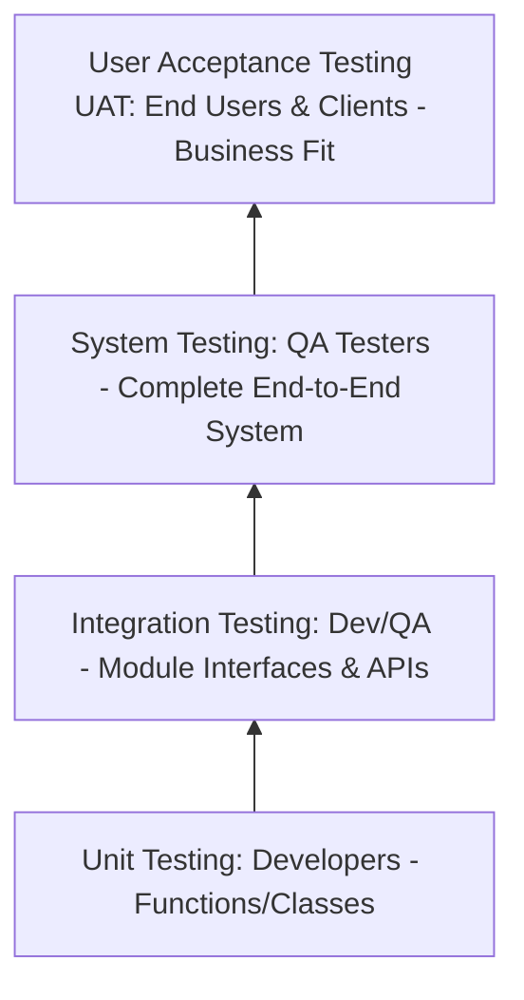

# 📅 Day 3: Levels of Testing

> **Theme**: Deep dive into the 4 primary levels of testing and the QA tester's specific responsibilities in System & Acceptance testing.

---

## 🎯 Learning Objectives

By the end of today, you will:
- [ ] Understand the 4 standard levels of testing: **Unit Testing**, **Integration Testing**, **System Testing**, and **User Acceptance Testing (UAT)**.
- [ ] Understand who executes each level (Developers vs Testers vs Business Users).
- [ ] Contrast Big-Bang, Top-Down, and Bottom-Up integration testing approaches.
- [ ] Master the tester's exact role in End-to-End System Testing.

---

## 📖 Core Concepts

### 1. The 4 Levels Detailed

| Level | Executed By | Focus Area | Objective |
| :--- | :--- | :--- | :--- |
| **Unit Testing** | Developers | Individual functions, methods, or components in isolation. | Catch logical errors at code level. |
| **Integration Testing** | Developers & QA | Data transfer and communication between combined modules. | Catch interface faults (e.g. Auth module passing token to Cart module). |
| **System Testing** | Dedicated QA Testers | Fully integrated software application evaluated against SRS. | Verify complete end-to-end functionality, performance, and UI flows. |
| **User Acceptance Testing (UAT)** | Clients, Business Analysts, End-users | Beta versions evaluated against business needs and contracts. | Obtain sign-off for live production release (Alpha & Beta testing). |

### 2. The Tester's Role in System Testing
As a manual QA tester, **System Testing** is your primary domain. You test:
- End-to-end user journeys (e.g. Sign up -> Add to Cart -> Apply Coupon -> Checkout -> Pay via UPI -> Order Confirmation).
- Negative scenarios and boundary conditions.
- Error handling and recovery.
- Cross-browser and UI layout integrity.

---

## 🛠️ Hands-On Task for Today

1. Pick an e-commerce platform (like Amazon or Flipkart).
2. Document an example of each level of testing for the "Search & Purchase" workflow:
   - What would be tested in Unit Testing?
   - What would be tested in Integration Testing?
   - What would be tested in System Testing?
   - What would be tested in UAT?
3. Save to `C:\QA_Training\02_Test_Cases\Day03_Testing_Levels.xlsx`.

---

## ❓ Interview Questions

1. Why can't we skip Unit and Integration testing and directly do System testing?
2. What is the difference between Alpha testing and Beta testing in UAT?
3. What is Top-down vs Bottom-up integration testing? What is a Stub and a Driver?
