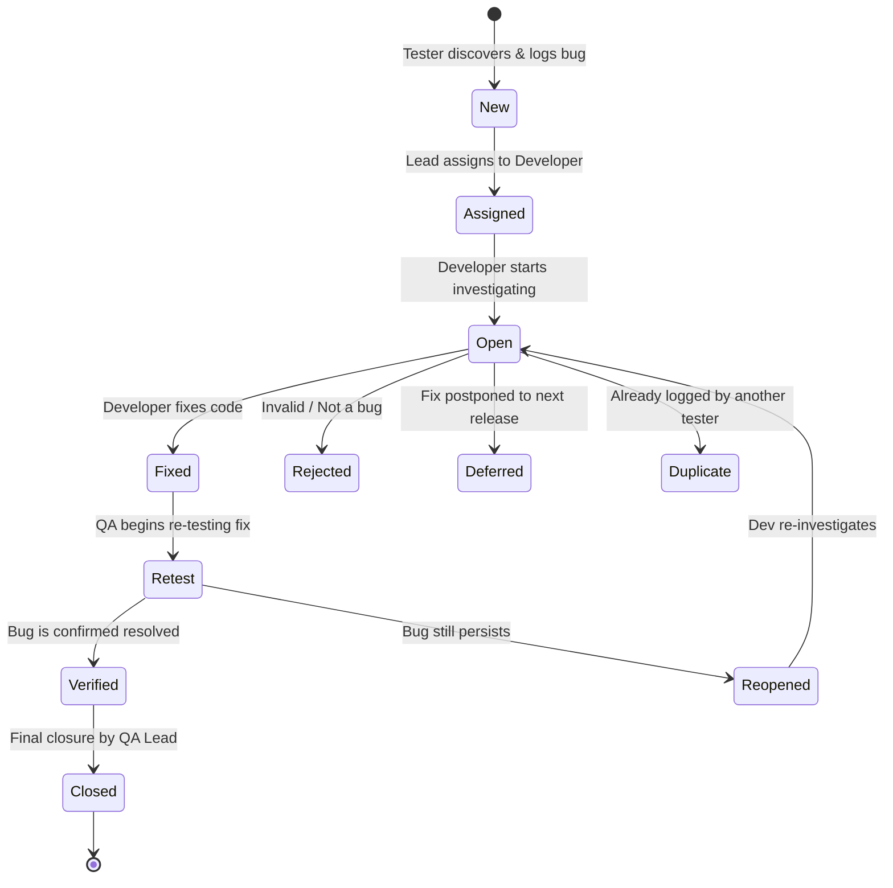

# 📅 Day 8: Defect Life Cycle (Bug Life Cycle)

> **Theme**: Understanding the life cycle of a bug from discovery to resolution, states, and the anatomy of a world-class defect report.

---

## 🎯 Learning Objectives

By the end of today, you will:
- [ ] Understand all states of the **Defect Life Cycle**: New, Assigned, Open, Fixed, Pending Retest, Retest, Verified, Closed, Reopened, Rejected, Deferred, Duplicate.
- [ ] Master the role of the tester and developer at each transition.
- [ ] Learn the anatomy of an effective, rejection-proof bug report.
- [ ] Draft a production-grade bug report using the [Bug Report Template](../../templates/bug-report-template.md).

---

## 📖 Core Concepts

### 1. Defect Life Cycle Workflow

### 2. Anatomy of a High-Quality Bug Report
A developer should be able to reproduce the defect in 60 seconds without having to call you:
- **Title / Summary**: `[Module] [Action] [Defect behavior]`
- **Severity & Priority**: Clear justification.
- **Environment**: OS, Browser version, URL, user permissions.
- **Pre-conditions & Numbered Steps**: Explicit, atomic actions.
- **Expected vs. Actual Result**: Clear contrast.
- **Evidence**: Annotated screenshots, DevTools network/console errors, screencast.

---

## 🛠️ Hands-On Task for Today

1. Pick an existing web application (e.g. any live e-commerce or travel portal).
2. Intentionally trigger a UI or validation issue (e.g. entering invalid characters or testing responsive layout on mobile viewport).
3. Using the [Bug Report Template](../../templates/bug-report-template.md), draft a complete Bug Report in Markdown or Word.
4. Save to `C:\QA_Training\03_Defect_Screenshots\Day08_Sample_Bug_Report.docx` (or `.md`).

---

## ❓ Interview Questions

1. Walk me through the complete Defect Life Cycle from 'New' to 'Closed'.
2. What will you do if a developer marks your bug ticket as 'Rejected' or 'Not a Bug'?
3. What is the difference between 'Deferred' and 'Duplicate'?
