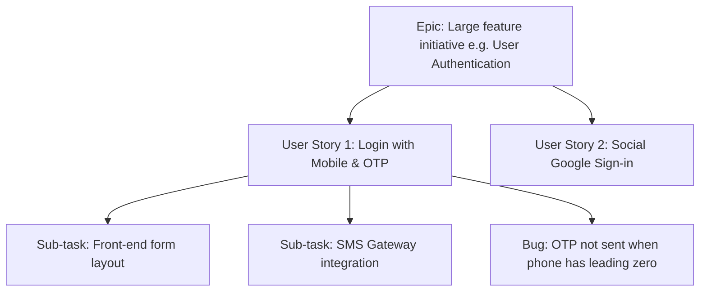

# 📅 Day 10: Introduction to Jira Software

> **Theme**: Exploring Atlassian Jira Cloud: Projects, Boards, Issue Types, Backlogs, and Sprints.

---

## 🎯 Learning Objectives

By the end of today, you will:
- [ ] Understand why Jira is the global industry standard for agile project tracking and bug management.
- [ ] Sign up for a free personal Atlassian Jira Cloud workspace.
- [ ] Understand Jira Hierarchy: **Epic -> User Story -> Task / Sub-task -> Bug**.
- [ ] Navigate Jira Kanban vs Scrum boards, Backlog view, and Active Sprints.

---

## 📖 Core Concepts

### 1. Jira Issue Hierarchy

### 2. Scrum Board vs. Kanban Board in Jira
- **Scrum Board**: Planned around fixed-length timeboxes (Sprints, usually 2 weeks). Features story point estimates, sprint burndown charts, and a backlog.
- **Kanban Board**: Continuous flow of work without sprints. Limits Work In Progress (WIP) to prevent developer overload.

---

## 🛠️ Hands-On Task for Today

1. Go to [Atlassian Jira Free](https://www.atlassian.com/software/jira/free) and create a free account with your email.
2. Create a new project:
   - Project Template: **Scrum** (Team-managed or Company-managed).
   - Project Name: `E-Commerce Store QA`.
   - Project Key: `ECS`.
3. Explore the navigation sidebar:
   - **Backlog**: Where product owner maintains prioritized stories.
   - **Active Sprints**: Where current sprint cards are tracked across `To Do`, `In Progress`, `Done`.
   - **Issues**: Search and filter tickets.
4. Take a screenshot of your active Jira board and save it in:
   `C:\QA_Training\03_Defect_Screenshots\Day10_Jira_Board_Setup.png`.

---

## ❓ Interview Questions

1. What is an Epic in Jira? How does it differ from a User Story?
2. What is the difference between a Scrum board and a Kanban board in Jira?
3. What is a Story Point in Agile Jira estimation?
