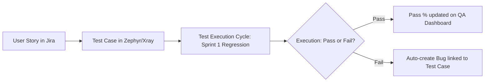

# 📅 Day 12: Jira Test Management Integrations (Zephyr Squad & Xray)

> **Theme**: Exploring how modern enterprise teams integrate Test Case Management directly into Jira using plugins like Zephyr Squad or Xray.

---

## 🎯 Learning Objectives

By the end of today, you will:
- [ ] Understand why IT companies use Test Management tools inside Jira instead of maintaining disconnected Excel sheets.
- [ ] Learn the architecture of **Zephyr Squad** and **Xray for Jira**.
- [ ] Understand Test Repository, Test Cycles, and Test Execution runs.
- [ ] Learn how test execution results directly generate QA metrics and dashboard charts.

---

## 📖 Core Concepts

### 1. Zephyr / Xray Workflow in Jira

### 2. Key Terms:
- **Test Case Issue Type**: Adds a custom issue type "Test" in Jira with dedicated step-by-step test script tables.
- **Test Cycle**: A grouping of test cases to be executed for a specific sprint, milestone, or release.
- **Traceability Matrix in Jira**: Instantly shows coverage for each story.

---

## 🛠️ Hands-On Task for Today

1. In your Jira Cloud workspace:
   - Go to **Apps** -> **Explore Apps / Marketplace**.
   - Search for **Zephyr Squad - Test Management for Jira** (Free 30-day trial available).
   - Alternatively, explore Xray or review Atlassian's Test Management tutorials.
2. Create 2 "Test" items inside Jira for the user login flow.
3. Add test steps, test data, and expected results directly in the Jira test window.
4. Execute the test: Mark one step as **PASS** and one step as **FAIL**.
5. Take screenshots of the Test Execution screen and save to:
   `C:\QA_Training\03_Defect_Screenshots\Day12_Zephyr_Test_Run.png`.

---

## ❓ Interview Questions

1. Have you used any Test Management tools integrated with Jira? Explain how you used them.
2. What are the advantages of writing test cases inside Jira (Zephyr/Xray) versus Google Sheets/Excel?
