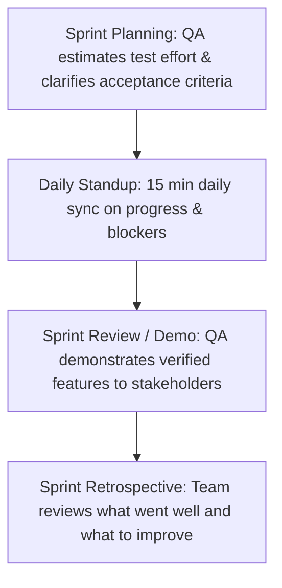

# 📅 Day 13: Agile Scrum Ceremonies from a QA Perspective

> **Theme**: Participating as a confident QA professional in real Agile ceremonies: Daily Standups, Sprint Planning, Refinement, Review, and Retrospectives.

---

## 🎯 Learning Objectives

By the end of today, you will:
- [ ] Understand the 4 core Scrum ceremonies and the QA tester's specific contributions in each.
- [ ] Master the 3-question format for **Daily Standups (Scrum)**.
- [ ] Learn how to estimate testing effort during **Sprint Planning** (Story Points / Hours).
- [ ] Understand **Sprint Retrospectives** and how QA uses them to improve release quality.

---

## 📖 Core Concepts: The 4 Scrum Ceremonies

### 1. Daily Standup (15-Minute Sync)
As a QA tester, always structure your 60-second update using the 3 golden questions:
1. **What did I test yesterday?**  
   *"Yesterday, I finished test execution for Story ECS-14 (Search filters) and logged 2 medium bugs."*
2. **What will I test today?**  
   *"Today, I am re-testing fixed bug ECS-18 and executing regression tests for the payment module."*
3. **Are there any blockers / impediments?**  
   *"I am blocked on Story ECS-20 because the staging database credentials expired this morning."*

### 2. Definition of Done (DoD) vs Definition of Ready (DoR)
- **Definition of Ready (DoR)**: User story has clear acceptance criteria and wireframes before entering a sprint.
- **Definition of Done (DoD)**: Feature is coded, unit-tested, all QA test cases passed, zero P1/P2 open bugs, and documented.

---

## 🛠️ Hands-On Task for Today

1. Write out your script for a **Daily Standup** speech for 3 consecutive days in a simulated sprint:
   - Day 1 speech: Beginning of sprint testing.
   - Day 2 speech: Mid-sprint progress with a reported blocker.
   - Day 3 speech: Retesting bug fixes and preparing for sprint demo.
2. Save to `C:\QA_Training\01_Requirements\Day13_Standup_Speech_Scripts.docx`.

---

## ❓ Interview Questions

1. What is your role as a QA in Sprint Planning?
2. What is the difference between Definition of Ready (DoR) and Definition of Done (DoD)?
3. How do you handle a situation where a developer delivers a feature to QA on the last day of the sprint?
