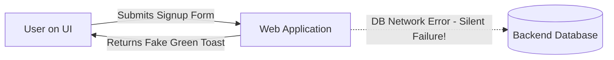

# 📅 Day 15: Database Testing Fundamentals

> **Theme**: Understanding why QA testers need SQL for backend database verification rather than trusting the UI alone.

---

## 🎯 Learning Objectives

By the end of today, you will:
- [ ] Understand why UI testing alone is insufficient (e.g. front-end says "Order Placed", but DB row was never inserted).
- [ ] Understand Relational Databases (RDBMS), Tables, Rows, Columns, and Data Types (`VARCHAR`, `INT`, `DATE`, `BOOLEAN`).
- [ ] Set up an interactive SQL environment (MySQL Workbench or free browser sandboxes like SQLiteOnline or W3Schools SQL).
- [ ] Understand Primary Keys (`PK`) and Foreign Keys (`FK`).

---

## 📖 Core Concepts

### 1. Why SQL is Mandatory for QA Testers

- **Scenario**: A user fills out a registration form. The browser says "Account created successfully!", but due to a backend bug, the user record is never inserted into the `users` table. The user tries to log in later and cannot.
- **Tester Action**: Only by querying the database (`SELECT * FROM users WHERE email = '...'`) can the tester verify true end-to-end data integrity.

---

## 🛠️ Hands-On Task for Today

1. Open [https://sqliteonline.com/](https://sqliteonline.com/) in your browser (no local installation required).
2. Create a test table:
   ```sql
   CREATE TABLE customers (
       customer_id INT PRIMARY KEY,
       first_name VARCHAR(50),
       last_name VARCHAR(50),
       email VARCHAR(100),
       city VARCHAR(50),
       is_active BOOLEAN
   );
   ```
3. Insert 3 rows:
   ```sql
   INSERT INTO customers VALUES (1, 'Ramesh', 'Kumar', 'ramesh@example.com', 'Hyderabad', 1);
   INSERT INTO customers VALUES (2, 'Priya', 'Sharma', 'priya@example.com', 'Bengaluru', 1);
   INSERT INTO customers VALUES (3, 'Anand', 'Verma', 'anand@example.com', 'Hyderabad', 0);
   ```
4. Query the table:
   ```sql
   SELECT * FROM customers;
   ```
5. Save your SQL queries to `C:\QA_Training\04_SQL_Scripts\Day15_DB_Setup.sql`.

---

## ❓ Interview Questions

1. Why is database testing necessary if the UI displays all confirmation messages?
2. What is the difference between a Primary Key and a Foreign Key?
3. What is Data Integrity in the context of backend testing?
