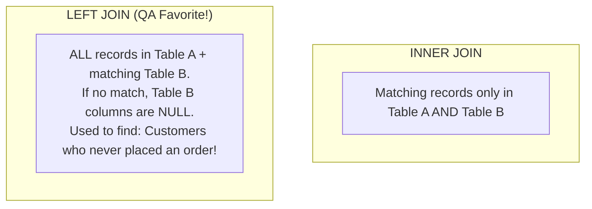

# 📅 Day 18: SQL Joins for QA: Comparing Related Tables

> **Theme**: Querying data across multiple normalized relational tables using `INNER JOIN`, `LEFT JOIN`, and `RIGHT JOIN`.

---

## 🎯 Learning Objectives

By the end of today, you will:
- [ ] Understand relational joins: combining records from two or more tables based on a related key.
- [ ] Master the 3 primary types of Joins:
  - **INNER JOIN**: Only matching records in both tables.
  - **LEFT JOIN**: All records from left table + matched records from right table (critical for identifying orphan records).
  - **RIGHT JOIN**: All records from right table + matched records from left table.
- [ ] Write QA verification queries to compare User profiles to their Orders and Payments.

---

## 📖 Visualizing SQL Joins



### Join Syntax Cheatsheet
```sql
-- INNER JOIN: Fetch orders with customer details
SELECT o.order_id, c.first_name, c.email, o.order_total, o.order_date
FROM orders o
INNER JOIN customers c ON o.customer_id = c.customer_id;

-- LEFT JOIN: Find customers who have NEVER placed an order (Orphan detection)
SELECT c.customer_id, c.first_name, c.email
FROM customers c
LEFT JOIN orders o ON c.customer_id = o.customer_id
WHERE o.order_id IS NULL;
```

---

## 🛠️ Hands-On Task for Today

1. In SQLiteOnline, create an `orders` table linked to `customers` via `customer_id`.
2. Write queries to solve:
   - Query 1: Display `order_id`, `customer_name`, and `total_amount` for all placed orders using `INNER JOIN`.
   - Query 2: Display all customers who have registered on the platform but have 0 orders in the database using `LEFT JOIN` and `IS NULL`.
3. Save to `C:\QA_Training\04_SQL_Scripts\Day18_SQL_Joins.sql`.

---

## ❓ Interview Questions

1. What is the difference between an `INNER JOIN` and a `LEFT JOIN`?
2. How do you find records in Table A that do not exist in Table B using SQL?
3. What happens if two tables in a JOIN query have columns with the exact same name?
