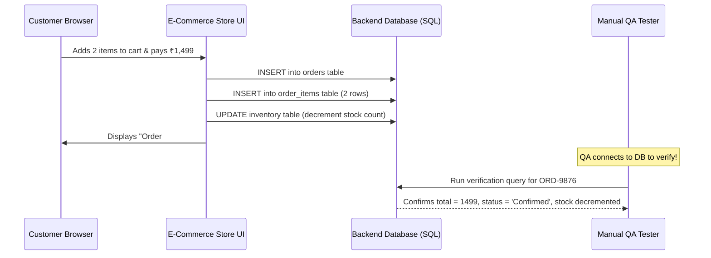

# 📅 Day 20: Real-World Database Validation Practice

> **Theme**: Mapping front-end UI actions to backend database tables and writing verification queries to ensure 100% data consistency.

---

## 🎯 Learning Objectives

By the end of today, you will:
- [ ] Connect front-end user actions (User Registration, Order Placement, Profile Update) to backend SQL schema tables.
- [ ] Write end-to-end verification scripts that prove database state matches UI displays.
- [ ] Identify data truncation, date timezone discrepancies, and status flag mismatches.
- [ ] Complete Phase 3 milestone review.

---

## 📖 End-to-End Validation Scenario: E-Commerce Checkout

### 3-Step Verification Checklist:
1. **Header Verification**: Query `orders` table to check `order_status = 'PAID'` and `grand_total = 1499.00`.
2. **Item Details**: Query `order_items` to confirm exact quantity and price snapshots.
3. **Side-Effect Verification**: Query `inventory` table to ensure stock was decremented by 2.

---

## 🛠️ Hands-On Task for Today

1. In Google Sheets, build a **UI-to-Database Mapping Specification**:
   - Columns: `UI Screen / Action`, `Form Fields Filled on UI`, `Target SQL Table`, `Expected Columns Updated`, `Verification SQL Query`.
2. Cover 3 full business flows:
   - Flow 1: New User Registration.
   - Flow 2: Password Reset.
   - Flow 3: Canceling an existing order.
3. Save to `C:\QA_Training\04_SQL_Scripts\Day20_UI_to_DB_Mapping.xlsx`.

---

## 🏆 Phase 3 Milestone Verification

You have completed Phase 3! Before moving to Phase 4 (Postman API Testing), verify:
- [x] You can write `SELECT` queries with multiple `WHERE`, `AND`, `OR`, `LIKE` conditions.
- [x] You can write queries using `COUNT()`, `SUM()`, `GROUP BY`, and `HAVING`.
- [x] You can write an `INNER JOIN` and a `LEFT JOIN` without looking at syntax cheatsheets.
- [x] You know how to answer `DELETE` vs `TRUNCATE` vs `DROP` in interviews.
