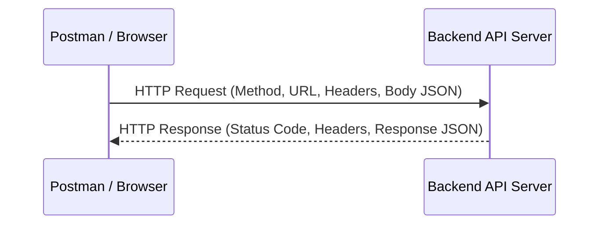

# 📅 Day 21: Client-Server Architecture & HTTP Basics

> **Theme**: Understanding how web and mobile apps talk to backends via REST APIs, HTTP methods, and JSON payloads.

---

## 🎯 Learning Objectives

By the end of today, you will:
- [ ] Understand the **Client-Server Architecture** (Browser/Mobile App = Client, Backend Server = Host).
- [ ] Understand what an **API (Application Programming Interface)** and **REST (Representational State Transfer)** are.
- [ ] Master the 5 standard HTTP Methods:
  - `GET`: Retrieve data without side effects.
  - `POST`: Create a new record.
  - `PUT`: Update/replace an entire existing record.
  - `PATCH`: Partially modify specific fields in an existing record.
  - `DELETE`: Remove a record.
- [ ] Understand the structure of **JSON (JavaScript Object Notation)**: Key-value pairs, Arrays, Objects, Booleans, Numbers.

---

## 📖 Core Concepts

### 1. Anatomy of an API Request & Response


- **Request URL / Endpoint**: `https://api.example.com/v1/users`
- **Request Headers**: `Content-Type: application/json`, `Authorization: Bearer <token>`
- **Request Body (JSON)**:
  ```json
  {
    "name": "Ramesh Kumar",
    "job": "QA Analyst",
    "skills": ["Manual Testing", "Jira", "SQL", "Postman"]
  }
  ```

---

## 🛠️ Hands-On Task for Today

1. Open Google Chrome DevTools (`F12`) and switch to the **Network** tab.
2. Filter by **Fetch/XHR**.
3. Visit any web application (e.g. `reqres.in` or an e-commerce site) and perform actions:
   - Click a button or search.
   - Observe the outgoing network calls.
   - Inspect the **Request Method**, **Status Code**, **Request Headers**, and **Response Body (JSON)**.
4. Take a screenshot highlighting a GET call and a POST call. Save to:
   `C:\QA_Training\05_Postman_Collections\Day21_DevTools_API_Inspection.png`.

---

## ❓ Interview Questions

1. What is an API in simple layman terms?
2. What is the difference between `PUT` and `PATCH` HTTP methods?
3. What is the difference between `GET` and `POST` in terms of request payload and security?
