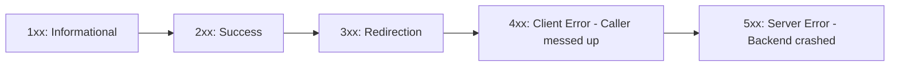

# 📅 Day 22: HTTP Status Codes & Response Payloads

> **Theme**: Mastering the 5 status code families (1xx, 2xx, 3xx, 4xx, 5xx) and identifying API defects from status codes.

---

## 🎯 Learning Objectives

By the end of today, you will:
- [ ] Memorize the 5 families of HTTP response status codes.
- [ ] Master the most common codes asked in every QA interview: `200`, `201`, `204`, `301`, `400`, `401`, `403`, `404`, `405`, `500`, `502`, `503`, `504`.
- [ ] Differentiate between **401 Unauthorized** (Who are you? - Authentication) and **403 Forbidden** (You cannot enter! - Authorization).
- [ ] Spot API bugs when servers return wrong status codes (e.g. returning `200 OK` with `{"error": "User not found"}`).

---

## 📖 The 5 HTTP Status Code Families

### Critical Status Codes for QA Testers

| Code | Meaning | When to Expect |
| :--- | :--- | :--- |
| **`200 OK`** | Request succeeded | Successful GET, PUT, or DELETE request. |
| **`201 Created`** | Resource successfully created | Successful POST request creating a new user/order. |
| **`204 No Content`** | Success, no payload to return | Successful DELETE request or logout. |
| **`301 / 302`** | Permanent / Temporary Redirect | URL moved or redirected to login screen. |
| **`400 Bad Request`** | Malformed syntax / invalid input | Missing required JSON fields, invalid email format. |
| **`401 Unauthorized`** | Authentication missing or invalid | Missing or expired auth token / wrong password. |
| **`403 Forbidden`** | Authenticated, but lacks permission | Normal user trying to access `/api/admin/delete-all`. |
| **`404 Not Found`** | Endpoint or record does not exist | Requesting `/api/v1/users/999999` which doesn't exist. |
| **`405 Method Not Allowed`**| Method not supported for URL | Sending a `POST` to an endpoint that only accepts `GET`. |
| **`500 Internal Server Error`**| Unhandled backend crash | Server crashed due to unhandled code exception or DB drop. |
| **`502 Bad Gateway`** | Gateway received invalid upstream | Proxy/Nginx cannot reach node/java backend service. |
| **`503 Service Unavailable`**| Server overloaded or down for maintenance | Rate limit exceeded or server undergoing deployment. |
| **`504 Gateway Timeout`**| Upstream server took too long | Database query timed out (> 30s). |

---

## 🛠️ Hands-On Task for Today

1. Open Google Sheets.
2. Build a **Status Code Bug Analysis Table**:
   - For each status code (`400`, `401`, `403`, `404`, `500`), write a concrete test case scenario where an API tester would expect that code.
   - Explain what bug you would log if the API returned `200 OK` with an error message instead of an appropriate `4xx` error code.
3. Save to `C:\QA_Training\05_Postman_Collections\Day22_HTTP_Status_Codes.xlsx`.

---

## ❓ Interview Questions

1. What is the difference between HTTP `401 Unauthorized` and `403 Forbidden`?
2. If an API returns `HTTP 200 OK` with response body `{"status": "failure", "message": "Invalid password"}`, is this a defect? Why?
3. What does HTTP `504 Gateway Timeout` indicate?
