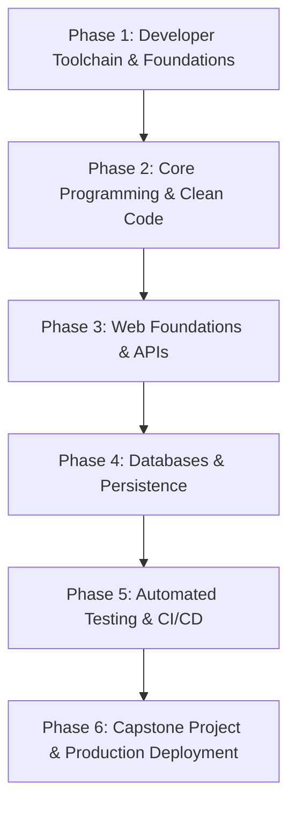

# 🗺️ High-Level Curriculum & Learning Roadmap

This document outlines the overarching curriculum journey for fresh engineering graduates transitioning into a professional software development environment.

---

## 🧭 Curriculum Phases Overview

The training plan is divided into cohesive phases designed to build practical engineering intuition progressively:

---

## 📅 Roadmap Breakdown

### Phase 1: Developer Toolchain & Foundations (Week 1)
*Focus: Getting comfortable with UNIX commands, Git collaboration, and development workflows.*
- **Day 1**: Workstation Setup, Terminal/Zsh, Modern CLI Utilities, Shell Scripting Basics.
- **Day 2**: Git Internals, Branching Strategies, Conflict Resolution, Clean Commit Messages.
- **Day 3**: GitHub Collaboration: Forks, Pull Requests, Code Reviews, and GitHub Issues.
- **Day 4**: Networking & The Internet: DNS, HTTP/HTTPS methods, headers, status codes, curl/Postman.
- **Day 5**: Weekly Milestone Review & Toolchain Self-Assessment.

---

### Phase 2: Core Programming & Clean Code (Week 2)
*Focus: Writing readable, maintainable, and idiomatic production code.*
- **Day 6**: Language Idioms & Modern Syntax Standards.
- **Day 7**: Data Structures in Practice (Maps, Sets, Trees) and Time/Space Complexity.
- **Day 8**: Object-Oriented & Functional Design Principles (SOLID, Immutability).
- **Day 9**: Error Handling, Exceptions vs Result types, and Defensive Programming.
- **Day 10**: Refactoring Legacy Code & Code Smells.

---

### Phase 3: Web Foundations, Backends & REST APIs (Week 3)
*Focus: Building robust server-side APIs and understanding client-server communication.*
- **Day 11**: Client-Server Architecture, Web Servers, and RESTful Design Patterns.
- **Day 12**: Building your first CRUD REST API with routing and validation.
- **Day 13**: Middleware, Authentication (JWT/Sessions), and Authorization.
- **Day 14**: API Documentation (OpenAPI/Swagger) and API Contract Testing.
- **Day 15**: Weekly Milestone: End-to-end API Mini-Project.

---

### Phase 4: Data Persistence & Databases (Week 4)
*Focus: Storing, indexing, querying, and modeling relational & NoSQL data.*
- **Day 16**: Relational Database Fundamentals (PostgreSQL/MySQL), Normalization.
- **Day 17**: Complex SQL Queries, Joins, Aggregations, and Window Functions.
- **Day 18**: Indexes, Query Optimization, `EXPLAIN ANALYZE`, and Performance.
- **Day 19**: ORMs vs Query Builders, Database Migrations, and Schema Evolution.
- **Day 20**: Caching Basics (Redis) and handling cache invalidation.

---

### Phase 5: Software Testing, Quality & CI/CD (Week 5)
*Focus: Test-Driven Development (TDD), mocking, automated pipelines, and code quality gates.*
- **Day 21**: Unit Testing Principles, Test Runners, Assertions, and Test Pyramid.
- **Day 22**: Integration Testing, Test Fixtures, and Mocking External Dependencies.
- **Day 23**: Linting, Code Formatting, Static Analysis, and Pre-commit Hooks.
- **Day 24**: GitHub Actions: Automated Build and Test Pipelines.
- **Day 25**: Security Best Practices: OWASP Top 10, Secrets Management.

---

### Phase 6: Production Engineering & Capstone Project (Week 6)
*Focus: Packaging, containerization, observability, and real-world deployment.*
- **Day 26**: Docker Fundamentals: Dockerfile, multi-stage builds, and container registries.
- **Day 27**: Multi-container applications with Docker Compose.
- **Day 28**: Logging, Metrics, and Observability Basics (Structured Logs, APM).
- **Day 29**: Deploying to Cloud / PaaS with health checks and environment configurations.
- **Day 30**: Capstone Demo Day, Peer Review, and Retrospective.

---

## 🎯 Graduate Competency Checklist

By the end of this curriculum, the graduate should independently be able to:

- [ ] Configure their local environment from scratch on any new laptop in under 2 hours.
- [ ] Create a feature branch, commit with Conventional Commits, open a PR with proper context, and resolve merge conflicts.
- [ ] Architect, build, and document a robust REST API with input validation and error handling.
- [ ] Write meaningful unit and integration tests with > 70% coverage.
- [ ] Set up a GitHub Actions workflow that runs tests on every pull request.
- [ ] Containerize their application using Docker.
- [ ] Troubleshoot common issues using terminal logs, debuggers, and network inspection tools.
