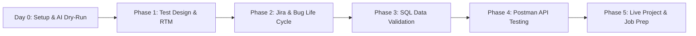

# 🎯 30-Day Day-by-Day Manual QA Training Plan

> **A comprehensive zero-coding curriculum designed to train fresh graduates in test design techniques, corporate Jira defect tracking, no-code API testing with Postman, and backend SQL database validation.**

---

## 🌟 What Makes This Program Different?

Most academic curricula teach theoretical software engineering but fail to train graduates in the day-to-day realities of software quality:
- **Zero Coding**: Designed for non-coders and fresh graduates targeting Manual QA, QA Analyst, and Functional Tester roles.
- **AI-Augmented Workbench**: Integrated with Google Gemini Desktop and Google Antigravity to simulate real-world AI-assisted testing workflows.
- **Enterprise Defect Tracking**: Real-world ticket authoring inside Atlassian Jira Cloud and simulated Agile Scrum ceremonies.
- **End-to-End Technical Depth**: Going beyond UI clicks to validate JSON payloads in Postman and query database tables using SQL.

---

## 🧭 Curriculum Breakdown

### [💻 Day 0: Laptop Setup, AI Workstation & Core Tooling](curriculum/setup/README.md)
Configure Google Gemini Desktop, Google Antigravity, Google Docs/Sheets offline, Chrome DevTools (`F12`), Snipping Tool, and structured Windows directories (`C:\QA_Training\...`). Complete the Day 0 AI Dry-run exercise.

### [📘 Phase 1: Core Testing Foundations & Design Techniques (Days 1–7)](curriculum/days/phase-1/day-01/README.md)
QA vs QC, Verification vs Validation, Waterfall vs Agile Scrum, SDLC vs STLC, Levels of Testing (Unit, Integration, System, UAT), Functional vs Non-Functional (Smoke, Sanity, Regression, Re-testing), Test Scenarios & Cases, Black-Box ECP & BVA, Decision Tables, and Requirement Traceability Matrices (RTM).

### [🐞 Phase 2: Defect Management & Jira Tool Mastery (Days 8–14)](curriculum/days/phase-2/day-08.md)
Defect Life Cycle from New to Closed, Severity vs Priority classification matrix, Atlassian Jira Cloud project setup, creating high-quality bug tickets, Jira test management (Zephyr/Xray), Agile Scrum ceremonies (Standups, Planning, Retros), and a 2-day Sprint Simulation on SauceDemo.

### [🗄️ Phase 3: SQL for Data Validation & Backend Testing (Days 15–20)](curriculum/days/phase-3/day-15.md)
Why testers need SQL, SELECT, WHERE, operators, aggregate functions (`COUNT`, `SUM`, `AVG`, `GROUP BY`, `HAVING`), relational joins (`INNER JOIN`, `LEFT JOIN` for orphan detection), data mutation (`INSERT`, `UPDATE`, `DELETE`, `ROLLBACK`), and real-world UI-to-Database mapping.

### [🔌 Phase 4: No-Code API Testing via Postman (Days 21–25)](curriculum/days/phase-4/day-21.md)
Client-Server architecture, HTTP methods (`GET`, `POST`, `PUT`, `DELETE`), HTTP status code families (2xx, 3xx, 4xx, 5xx), Postman Desktop setup, executing requests against ReqRes, building Postman Collections, Collection Runner, and Environment Variables.

### [💼 Phase 5: Live Project Execution & Hyderabad Job Prep (Days 26–30)](curriculum/days/phase-5/day-26.md)
Authoring a 50+ Test Case Suite on a live e-commerce portal, Cross-browser and mobile device emulation testing, building an ATS-optimized Manual QA resume, targeted job hunt strategy for Hyderabad (HITEC City, Madhapur, Gachibowli, Financial District), and a 360-degree Mock Technical Interview.

---

## 📝 Reusable Corporate Templates

- [📋 Manual Test Case Template](curriculum/templates/test-case-template.md)
- [🐞 Industry Bug Report Template](curriculum/templates/bug-report-template.md)
- [🔗 Requirement Traceability Matrix (RTM) Template](curriculum/templates/rtm-template.md)
