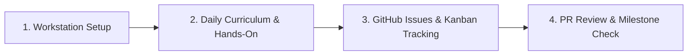

# 🚀 Software Engineering Jumpstart

> **A structured, industry-aligned training curriculum designed to transition fresh graduates into confident software engineers.**

---

## 🌟 Why This Program?

Transitioning from computer science degrees to professional software teams requires more than coding syntax—it requires mastery over developer tooling, version control hygiene, collaborative problem-solving, and continuous progress tracking.

This portal and repository are designed around the same feedback loop used by high-performance engineering teams at tech companies.

---

## 🧭 Key Sections

### 1. [Device & Toolchain Setup](curriculum/setup/README.md)
Get your local machine configured with Unix shell utilities, Homebrew/WSL2, Git, SSH keys, VS Code, and essential linting tools.

### 2. [Curriculum Overview & Roadmap](curriculum/overview.md)
Understand the full 6-phase journey from Command-Line mastery to Full-Stack REST APIs, Docker, and CI/CD pipelines.

### 3. [Day-by-Day Learning Modules](curriculum/days/day-01/README.md)
Start with **Day 1: Developer Environment & Command-Line Mastery**, complete hands-on log analysis scripts, and check off daily learning targets.

### 4. [GitHub Kanban Board Guide](guides/github-kanban-guide.md)
Learn how to use GitHub Projects to organize daily tasks, visualize your work in progress, and maintain momentum.

---

## 💡 Quick Tips for Learners

- **Commit frequently**: Write small, focused commits with clear messages.
- **Log every day**: Always open your daily GitHub issue before you write code.
- **Ask early**: If stuck for more than 30 minutes, open a **Doubt / Blocker** issue.
