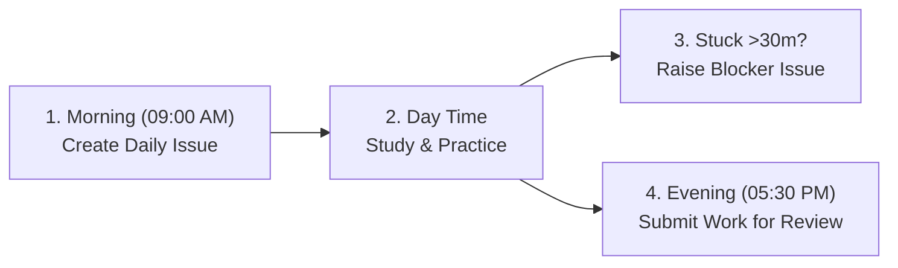

# 📢 Candidate Onboarding Instructions & Daily Routine Guide

Welcome to the **30-Day Manual QA Training & Job Readiness Program**! 

This program is structured to transition you from an academic graduate into a confident, production-grade **Manual QA Analyst** ready for IT software companies.

---

> **Submission privacy:** This curriculum repository is public. Use the private submission location your mentor provides for daily work, scores, and personal information. Public issues are for non-personal course questions only.

## 🔗 Key Links to Bookmark

- 🌐 **Live Curriculum Portal**: [https://sn8c29kyhh-star.github.io/seeker/](https://sn8c29kyhh-star.github.io/seeker/)
- 🐙 **GitHub Repository**: [https://github.com/sn8c29kyhh-star/seeker](https://github.com/sn8c29kyhh-star/seeker)
- 📋 **Project Kanban Board**: [https://github.com/sn8c29kyhh-star/seeker/projects](https://github.com/sn8c29kyhh-star/seeker/projects)
- 💬 **Discussion Forum**: [https://github.com/sn8c29kyhh-star/seeker/discussions](https://github.com/sn8c29kyhh-star/seeker/discussions)

---

## 🏁 Step 1: Complete "Day 0" System Setup (Do This First!)

Before reading any testing theory, you must set up your machine and testing tools:

1. Open the **[Day 0 Setup Guide](https://sn8c29kyhh-star.github.io/seeker/#/curriculum/setup/README)**.
2. **Install AI Assistants**:
   - Install **Google Gemini Desktop App** (from `gemini.google.com`) and pin to your Taskbar.
   - Install **Google Antigravity** (`antigravity.google`).
3. **Set Up Productivity & Folders**:
   - Bookmark Google Sheets and Google Docs (enable offline mode).
   - Create this exact folder structure in Windows File Explorer:
     ```text
     C:\QA_Training\
     ├── 01_Requirements\
     ├── 02_Test_Cases\
     ├── 03_Defect_Screenshots\
     ├── 04_SQL_Scripts\
     └── 05_Postman_Collections\
     ```
4. **DevTools & Screenshots**:
   - Learn the `F12` shortcut in Chrome (Elements, Console, Network tabs).
   - Test the Windows Snipping Tool shortcut: `Win + Shift + S`.
5. **Day 0 AI Dry-Run**:
   - Ask Gemini Desktop: *"Generate 5 negative test scenarios for an Indian mobile number login screen (10 digits, +91 country code, OTP verification)."*
   - Format the response into columns in Google Sheets and save to `C:\QA_Training\02_Test_Cases\`.

---

## 🔄 Step 2: Your Daily 4-Step Routine (Days 1 to 30)

Every day from 9:00 AM to 6:00 PM, follow this agile workflow:



### 1. Morning Standup (9:00 AM)
- Go to **Issues → New issue** in the private submission repository your mentor provides.
- Select **Daily QA Progress Log**.
- Title it: `Day [XX]: [Module Title]`.
- Assign yourself, select your Kanban Board, and drag your card to **`In Progress`**.

### 2. Deep Dive & Hands-On Practice (10:00 AM – 5:00 PM)
- Open the specific day's guide from the [Live Curriculum Website](https://sn8c29kyhh-star.github.io/seeker/).
- Read through the concepts and industry examples.
- Execute the hands-on exercise (writing test cases in Sheets, logging defects in Jira, running SQL queries, or making Postman API requests).
- Save all files locally in your `C:\QA_Training\` directory.

### 3. If You Get Stuck (The 30-Minute Rule)
- If you encounter a bug, confusion, or tool failure and cannot solve it within **30 minutes**:
  1. Ask Gemini Desktop for clarification first.
  2. If still blocked, open **New Issue → Blocker or Technical Doubt** in your private submission repository.
  3. Fill out what you tried, paste screenshots/error messages, and tag your mentor.

### 4. End of Day Review (5:30 PM)
- Open your morning GitHub Issue.
- Check off all completed checklist items.
- In the issue comments, paste your shareable Google Drive link / file path and fill out your 3 Key Learnings.
- Move your card to **`In Review`**. Only mark the assessed work `Done` after your mentor approves it. The portal’s study-complete button is a personal reminder, not a pass.

---

## 💡 Top 3 Success Rules for Candidates

1. **Zero Coding Fear**: You do not need to write code. Focus on test coverage, boundary edge cases, clear reproduction steps, and attention to detail.
2. **Quality Documentation**: Write test cases so clearly that a developer or external auditor can reproduce them without asking questions.
3. **Be Proactive**: Treat this repository and Jira board like a real production job at an IT company. Maintain continuous communication through daily issues.
