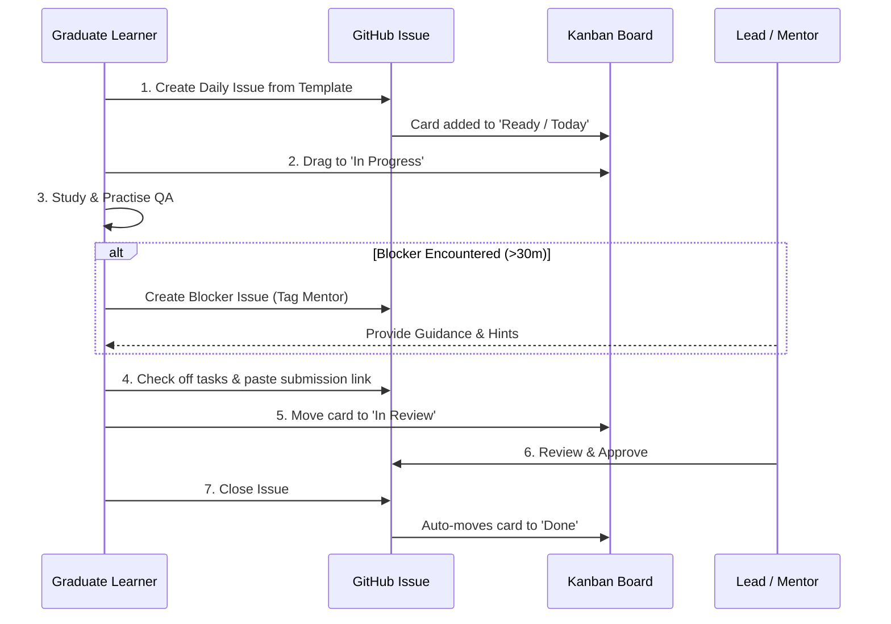

# 📊 Comprehensive Guide: Setting Up GitHub Projects & Kanban Tracking

Tracking daily progress using a **Kanban Board** gives both the learner and mentor immediate visual clarity on what is planned, actively in development, awaiting review, or completed.

---

> Use a private submission repository for student work and scores. A filtered view on a shared board does not make its issues private. Keep the public curriculum repository for course content.

## 🏗️ Step 1: Create a New GitHub Project Board

1. In your GitHub repository, click on the **Projects** tab (located next to Issues and Pull Requests).
   *(Note: You can also create a Project at the Organization or User profile level if managing multiple learners).*
2. Click the green **New Project** button.
3. Choose the **Board** template (cards organized in columns) and click **Create**.
4. Name your project:
   - Example: `🎓 Manual QA Jumpstart: [Graduate Name] Progress Board`

---

## 📋 Step 2: Configure Your Kanban Columns

Customize the columns to represent your daily workflow stages:

| Column Name | Purpose |
| :--- | :--- |
| **📥 Backlog** | Future curriculum days (Phase 2, Phase 3, Capstone). |
| **🎯 Ready / Today** | The specific day's issue scheduled for today. |
| **⏳ In Progress** | The learner is currently studying, designing test cases, or testing. |
| **👀 In Review** | Test sheets / bug tickets submitted for mentor review. |
| **✅ Done** | Day's deliverables verified, self-assessment answered, issue closed. |

> **Pro Tip**: To add or edit columns in GitHub Projects:
> - Click the **+** icon to the right of the columns to add a new column.
> - Click the **...** menu on any column header to rename or reorder it.

---

## 🔗 Step 3: Link the Project to Your Repository

1. In the top-right corner of your project board, click the **...** menu -> **Settings**.
2. Under **Manage access**, link your repository so issues created in the repo can be directly added to this board.

---

## ⚡ Step 4: Enable Built-in Workflows (Automation)

GitHub Projects allows automatic card movement:
1. In your project board, click the **...** menu in the top right -> **Workflows**.
2. Turn ON the following recommended automations:
   - **Item added to project**: Sets default status to `Backlog` or `Ready / Today`.
   - **Item closed**: Automatically moves cards to **`Done`** when an issue or PR is closed!
   - **Pull request merged**: Automatically moves the linked card to **`Done`**.

---

## 🔄 Daily Tracking Walkthrough for the Fresh Graduate

### Daily Checklist:
1. **Morning (9:00 AM)**:
   - Go to **Issues** -> **New Issue**.
   - Select **Daily Progress Log**.
   - Under the right sidebar:
     - **Assignee**: Assign yourself.
     - **Projects**: Select your Jumpstart board.
     - **Labels**: Select `daily-log`.
   - On the project board, drag the card into **In Progress**.

2. **Mid-Day (If Stuck)**:
   - Do not stay blocked for more than 30 minutes.
   - Create an issue using the **Blocker or Technical Doubt** template.
   - Tag your mentor (e.g. `@mentor-username`).

3. **Evening (5:30 PM)**:
   - Update your daily issue: check all completed checkboxes.
   - Paste your exercise attachment or mentor-accessible submission link.
   - Fill out the 3 quick questions in *Key Learnings & Takeaways*.
   - Move the issue to `In Review`. Close it only after your mentor approves the submission.
