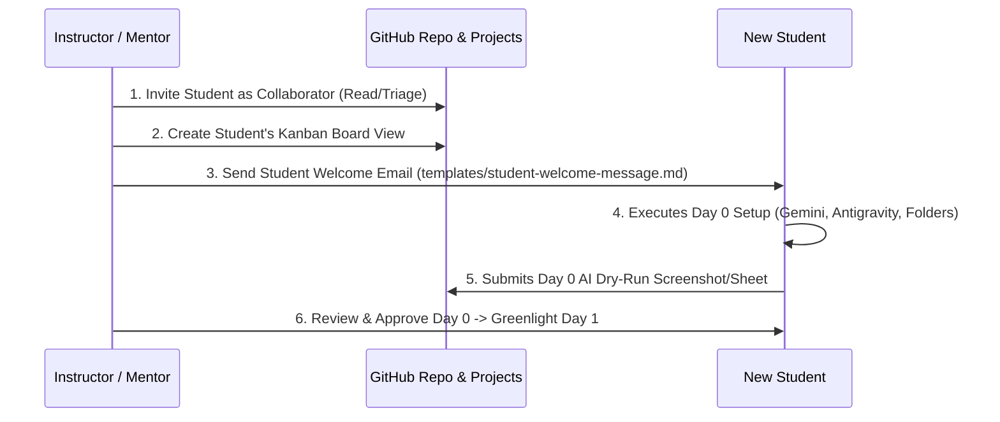

# 🧑‍🏫 Instructor & Mentor Operational Guidebook

This directory contains the **Standard Operating Procedures (SOP)**, operational checklists, communication templates, and assessment rubrics for mentors and instructors guiding fresh graduates through the **30-Day Manual QA Jumpstart Program**.

---

## Integrated workspace

Use [My workspace](https://sn8c29kyhh-star.github.io/seeker/workspace.html) for enrollment, attendance, private submissions, feedback, and mentor-controlled progression. Follow the [workspace setup guide](../guides/workspace-operations.md) first. The GitHub issue/board workflow below remains an optional alternative for a manual pilot.

## 🗂️ Instructor Toolkit Contents

| Resource | Purpose | Link |
| :--- | :--- | :--- |
| **New Student Setup SOP** | Step-by-step checklist to onboard a new student into the repo and Kanban | [README.md](#-step-by-step-new-student-onboarding-workflow) |
| **Student Welcome Email** | Ready-to-send email/Slack message template for Day 0 kickoff | [templates/student-welcome-message.md](templates/student-welcome-message.md) |
| **New Student Setup Checklist** | Pre-onboarding to Day 1 readiness checklist | [checklists/new-student-setup-checklist.md](checklists/new-student-setup-checklist.md) |
| **Weekly Evaluation Rubric** | Scoring and feedback template for weekly milestone reviews | [templates/weekly-evaluation-rubric.md](templates/weekly-evaluation-rubric.md) |
| **Mock Interview Rubric** | 360-degree technical scoring sheet for Day 30 exit interview | [templates/mock-interview-scoring-sheet.md](templates/mock-interview-scoring-sheet.md) |

---

## 🚀 Step-by-Step New Student Onboarding Workflow

Follow this procedure whenever a new fresh graduate or cohort begins training:

### Phase A: GitHub Workspace Setup (Before Day 0)
1. **Repository Access**:
   - Create a separate private submission repository for each student and give the student access there. Copy the daily progress issue template into that repository.
   - Keep student scores and personal submissions out of the public curriculum repository.
   - Go to that private repo **Settings** -> **Collaborators**.
   - Click **Add people** and invite the candidate by their GitHub username or email.
   - Verify the student can create submissions and access their board using their account. Do not grant write access to the public curriculum just for progress tracking.
2. **Setup Student's Kanban Tracking**:
   - Open [Projects Tab](https://github.com/sn8c29kyhh-star/seeker/projects).
   - If using **Single Shared Board**: Add a new Tab/View named `[Student's Name]` with filter: `assignee:[github-username]`.
   - If using **Dedicated Board per Student**: Click **New Project** -> Select **Board** -> Name it `🎓 QA Jumpstart: [Student Name]`. Add standard columns: `Backlog`, `Ready / Today`, `In Progress`, `In Review`, `Done`.

### Phase B: Send the Welcome Message (Day 0 Morning)
1. Open [`instructor/templates/student-welcome-message.md`](templates/student-welcome-message.md).
2. Fill in:
   - `[Student Name]`
   - `[Start Date]`
   - `[Your Name / Contact Info]`
3. Send via Email / WhatsApp / Slack / Teams.

### Phase C: Day 0 Verification Gate (Day 0 Evening)
Before allowing the student to begin Day 1, verify that they completed:
- [ ] Google Gemini Desktop app installed and tested.
- [ ] Google Antigravity installed.
- [ ] Folder structure `C:\QA_Training\` with all 5 subdirectories verified via screenshot.
- [ ] Day 0 AI Dry-Run completed: `C:\QA_Training\02_Test_Cases\Indian_Mobile_Login_Negative_Scenarios.xlsx`.

---

## 📅 Daily Instructor Review Cadence (Days 1 to 30)

| Time | Instructor Action |
| :--- | :--- |
| **09:00 - 09:30 AM** | Check that the student opened their **Daily QA Progress Log** issue and dragged it to `In Progress` on the Kanban board. |
| **12:00 - 12:15 PM** | Check the **Issues** tab for any open `blocker` or `needs-help` issues. Reply with guiding hints (don't give direct answers; teach debugging intuition). |
| **05:30 - 06:00 PM** | Review the submitted daily issue comments, verify Google Sheet / Jira links, write 2 lines of constructive feedback, and approve closing the issue. |

---

## 📊 Phase-Wise Grading Milestones

- **End of Week 1 (Day 7)**: Review the student's 100% test coverage Requirement Traceability Matrix (RTM).
- **End of Week 2 (Day 14)**: Inspect the student's Jira workspace. Verify that the 5 logged defects have proper severity/priority and reproduction steps.
- **End of Week 3 (Day 20)**: Whiteboard review of SQL queries (`SELECT`, `GROUP BY`, `HAVING`, `LEFT JOIN`).
- **End of Week 4 (Day 25)**: Review the exported Postman collection JSON and verify status code checks.
- **End of Week 5 (Day 30)**: Conduct the formal 45-minute mock interview using [`instructor/templates/mock-interview-scoring-sheet.md`](templates/mock-interview-scoring-sheet.md).
